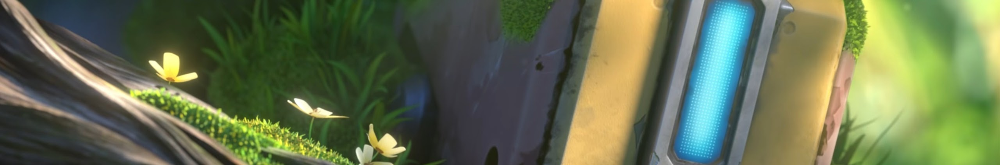
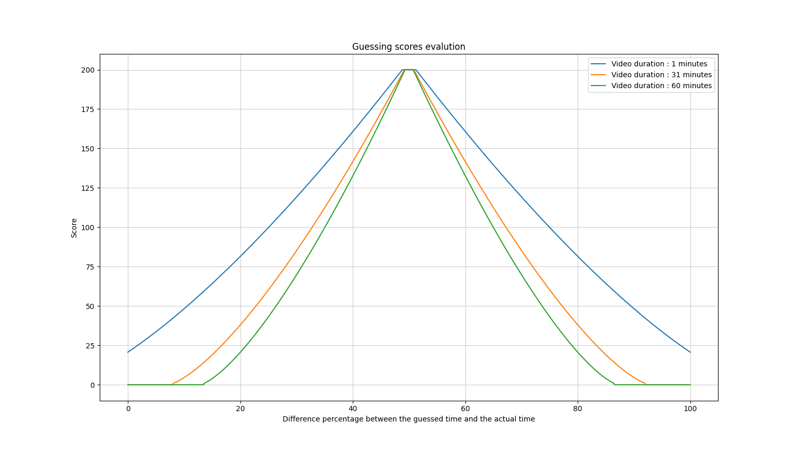
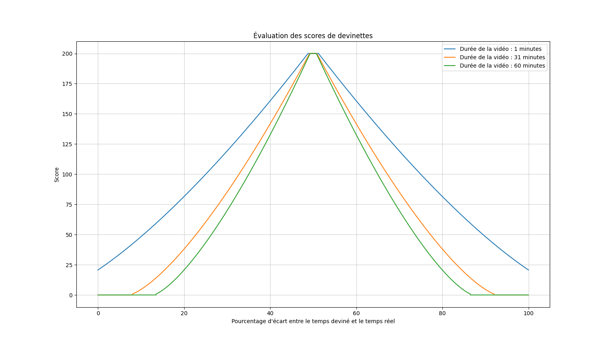

# TheGreatGuess

[English](#english)

[Français](#français)

## English

### Presentation

This project is a quiz to test knowledge on the structure of chosen videos. The default are the videos from **TheGreatReview**'s main channel. The idea is to show a few lines that were said during the videos and for the user to try to identify which video the extract is from. Then, if the video is **guessed** correctly, the user should try to estimate when the extract has been pronounced in the video, rewarding them with points regarding how close they were to the actual timecode. It's supposed to be a hard quiz, getting above half the points is pretty remarkable. Getting a perfect score is close to impossible, as the subtitles are not always perfect (especially the French ones, which come from YouTube's automatic transcription). A reasonable target you can aim for is about 40% of the points (2400/6000 points for 15 questions).

### Rounds

Once on the [website](https://hrlupa.github.io/TheGreatGuess), you can choose the amount of rounds to play: 5, 15, 30, or infinite. If you choose a finite number of rounds, you can set a new record for that specific amount of rounds. This score will be saved locally and can be used as a target in future games.

### Video

A phrase will appear on the screen: this will be either a transcription of a clip of a video, or a translation of that clip. In either case, your goal is to identify the title of the original video. If the title doesn't come to mind, try entering keywords related to the video's theme : the video's title will likely be suggested to you. If you find the correct video, you will receive 200 points and get the chance to guess at what point in the video the displayed phrase was spoken.

### Correct Answer

If you find the correct video, you will get a bit more context and be asked to *guess* at what point in the video the clip was spoken.
You can enter the time in formats such as `XX:XX:XX` or `XXhXXmXXs`. By default, the input corresponds to minutes, then hours, and then seconds (for example, `1:2` corresponds to 1 hour and 2 minutes, and `25` corresponds to 25 minutes). The input is insensitive to case, spaces, and accents.

After making your guess, you will be awarded a score based on how close you were to the exact time. You can earn up to 200 points by finding the exact time. As a guide, you can score points within a range covering about 50% of the video's total duration (the duration will be displayed), and the calculation follows a quadratic curve (a one-minute difference results in a larger point variation when you're close to the target).

### Incorrect Guess

If you guess an incorrect video, a clip showing the target video will be shown to you starting at the moment corresponding to the displayed text, helping you recall the scene for the next time.

### Advanced

If you have ideas for improvement or notice any unexpected behavior on the site, please contact me on [Discord](https://discord.com/users/545300661302984714) or open an [issue](https://github.com/HRLupa/TheGreatGuess/issues) to let me know so I can make updates.

## Français

### Présentation

Ce projet est un quiz pour tester les connaissances du texte prononcé dans certaines vidéos. Les vidéos sélectionnées par défaut viennent de la chaine principale de **TheGreatReview**. Le principe du projet est de montrer à l'utilisateur un extrait textuel de la vidéo, et de le laisser identifier la vidéo dont l'extrait provient. Ensuite, si l'utilisateur a **guess** la bonne vidéo, il a l'occasion d'essayer de deviner le moment dans la vidéo d'où l'extrait a été tiré, récupérant des points en fonction d'à quel point il est proche de sa cible. Le quiz est voulu comme étant difficile, réussir à obtenir plus de la moitié des points du premier coup est remarquable. Il est déraisonnable de viser un score parfait, car les sous-titres peuvent parfois induire des erreurs (surtout les sous-titres français, venant de la transcription automatique de YouTube). Ceci dit, un score cible raisonnablement atteignable avec de l'entrainement serait d'obtenir 40% des points (2400/6000 points sur 15 questions).

### Manches

Une fois sur le [site web](https://hrlupa.github.io/TheGreatGuess), vous pourrez choisir le nombre de manches à jouer : 5, 15, 30 ou infini. Si vous choisissez un nombre fini de manches, vous aurez la possibilité d'établir un nouveau record pour ce nombre de manches ; ce score sera enregistré localement et pourra vous servir d'objectif pour vos futures parties.

### Vidéo

Une phrase s'affichera à l'écran : il s'agira d'un extrait vidéo, ou d'une traduction de cet extrait. Dans les deux cas, votre objectif sera de retrouver le titre de la vidéo d'origine. Si le titre ne vous vient pas à l'esprit, essayez d'entrer des mots-clés thématiques de la vidéo, il est probable qu'elle vous soit suggérée. Si vous trouvez la bonne vidéo, vous recevrez 200 points et aurez l'occasion de *guess* à quel moment de la vidéo la phrase affichée a été prononcée.

### Bonne réponse

Si vous avez trouvé la bonne vidéo, vous obtiendrez un peu plus de contexte et serez invité à *guess* à quel moment de la vidéo l'extrait a été prononcé.
Vous pouvez saisir l'heure sous les formats `XX:XX:XX` ou `XXhXXmXXs`. Par défaut, la saisie correspond aux minutes, puis aux heures, et aux secondes (par exemple, `1:2` correspond à 1 heure 02 minutes, `25` correspond à 25 minutes). La casse (majuscules/minuscules), les espaces, et les accents ne sont pas pris en compte.

Après avoir fait votre *guess*, un score vous sera attribué en fonction de votre proximité au temps exact. Vous pourrez gagner jusqu'à 200 points en trouvant le moment précis. À titre indicatif, il est possible de marquer des points sur environ 50 % de la durée totale de la vidéo (la durée vous sera indiquée), et le calcul suit une augmentation quadratique (un écart d'une minute entraîne une variation de points plus importante lorsque vous êtes proche de la cible).

### Mauvaise réponse

Si vous avez *guess* la mauvaise vidéo, la séquence vidéo qui était à trouver vous sera présentée à partir du moment correspondant au texte affiché, afin que vous puissiez vous souvenir de la scène.

### Avancé

Si vous avez des idées d'amélioration ou si vous constatez des comportements sur le site qui vous semblent indésirés, je vous invite à me contacter sur [Discord](https://discord.com/users/545300661302984714) ou à ouvrir une [issue](https://github.com/HRLupa/TheGreatGuess/issues) pour m'en informer, afin que je puisse faire la mise à jour.
